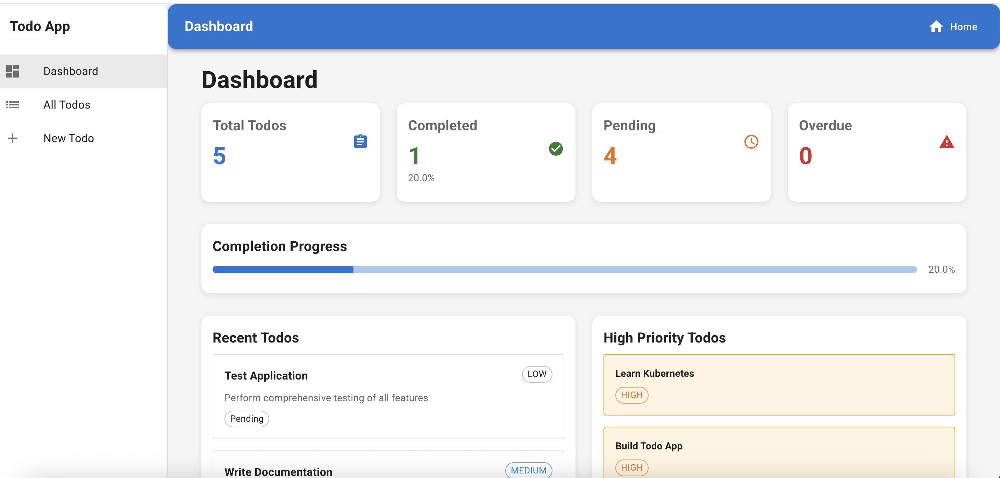
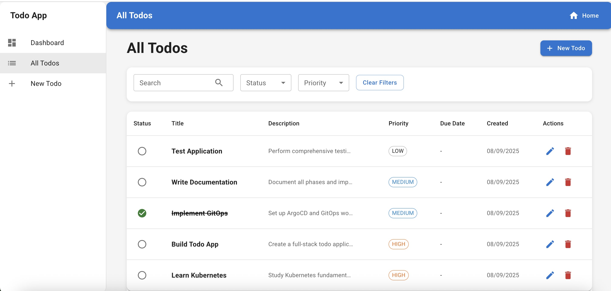
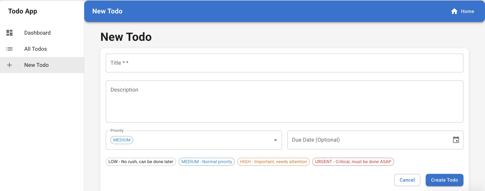
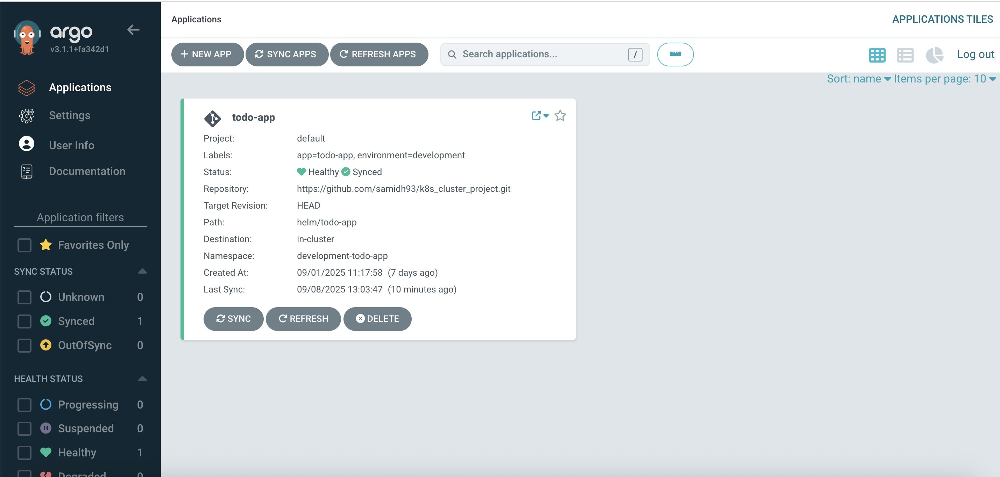
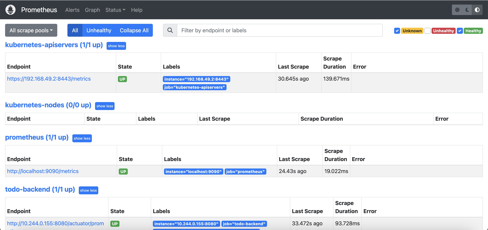
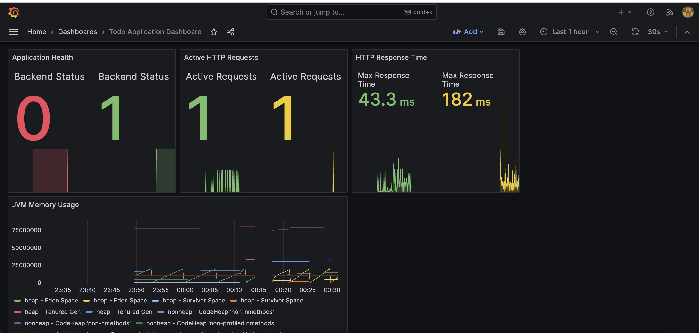

# 🚀 Todo Application - Kubernetes & GitOps Project


A comprehensive **full-stack Todo application** built with modern cloud-native technologies, featuring **GitOps deployment**, **CI/CD automation**, and **observability monitoring**. This project demonstrates production-ready Kubernetes deployment patterns, containerization best practices, and automated infrastructure management.

## 📋 Table of Contents

- [🎯 Project Overview](#-project-overview)
- [🏗️ Architecture](#️-architecture)
- [✨ Features](#-features)
- [🛠️ Tech Stack](#️-tech-stack)
- [📸 Screenshots](#-screenshots)
- [🚀 Quick Start](#-quick-start)
- [📚 Documentation](#-documentation)
- [🔧 Development](#-development)
- [📊 Monitoring & Observability](#-monitoring--observability)
- [🔄 CI/CD Pipeline](#-cicd-pipeline)
- [📁 Project Structure](#-project-structure)
- [🤝 Contributing](#-contributing)
- [📄 License](#-license)

## 🎯 Project Overview

This project showcases a **production-ready Todo application** deployed on Kubernetes with the following key capabilities:

- **Full-Stack Application**: React frontend + Spring Boot backend + PostgreSQL database
- **Container Orchestration**: Kubernetes with Helm charts for deployment management
- **GitOps Workflow**: ArgoCD for automated, declarative deployments
- **CI/CD Automation**: GitHub Actions for build, test, and deployment pipelines
- **Observability**: Prometheus metrics collection + Grafana dashboards
- **Security**: Network policies, RBAC, and secure container practices
- **Scalability**: Horizontal Pod Autoscaling and load balancing

## 🏗️ Architecture

The application follows a **microservices architecture** with clear separation of concerns:

```
┌─────────────────┐    ┌─────────────────┐    ┌─────────────────┐
│   React SPA     │    │  Spring Boot    │    │   PostgreSQL    │
│   (Frontend)    │◄──►│   (Backend)     │◄──►│   (Database)    │
│   Port: 3000    │    │   Port: 8080    │    │   Port: 5432    │
└─────────────────┘    └─────────────────┘    └─────────────────┘
         │                       │                       │
         └───────────────────────┼───────────────────────┘
                                 │
                    ┌─────────────────┐
                    │   Nginx Proxy   │
                    │  (Load Balancer)│
                    │   Port: 80/443  │
                    └─────────────────┘
```

### Infrastructure Components

- **Kubernetes Cluster**: Container orchestration platform
- **ArgoCD**: GitOps continuous deployment
- **Prometheus**: Metrics collection and monitoring
- **Grafana**: Visualization and alerting dashboards
- **Helm**: Package management for Kubernetes applications
- **GitHub Actions**: CI/CD pipeline automation

## ✨ Features

### 🎨 Frontend Features
- **Modern React SPA** with TypeScript
- **Material-UI Components** for consistent design
- **Responsive Design** for mobile and desktop
- **Real-time Updates** with API integration
- **Todo Management**: Create, read, update, delete todos
- **Priority Management**: High, medium, low priority levels
- **Due Date Tracking**: Calendar integration with date pickers
- **Search & Filter**: Find todos by status, priority, or text
- **Statistics Dashboard**: Completion rates and analytics

### 🔧 Backend Features
- **RESTful API** with Spring Boot
- **JPA/Hibernate** for database operations
- **CORS Configuration** for cross-origin requests
- **Health Checks** and actuator endpoints
- **Input Validation** and error handling
- **Database Migrations** with Flyway
- **Metrics Collection** for Prometheus

### 🗄️ Database Features
- **PostgreSQL** with persistent storage
- **ACID Compliance** for data integrity
- **Backup & Recovery** strategies
- **Connection Pooling** for performance
- **Data Seeding** for development

## 🛠️ Tech Stack

### Frontend
- **React 18** - Modern UI library
- **TypeScript** - Type-safe JavaScript
- **Material-UI** - Component library
- **Axios** - HTTP client
- **React Router** - Client-side routing
- **Day.js** - Date manipulation

### Backend
- **Spring Boot 3.x** - Java framework
- **Spring Data JPA** - Data persistence
- **Spring Web** - REST API
- **Spring Security** - Authentication
- **PostgreSQL Driver** - Database connectivity
- **Maven** - Build tool

### Infrastructure
- **Kubernetes** - Container orchestration
- **Docker** - Containerization
- **Helm** - Package management
- **ArgoCD** - GitOps deployment
- **Prometheus** - Metrics collection
- **Grafana** - Monitoring dashboards
- **Nginx** - Reverse proxy

### DevOps
- **GitHub Actions** - CI/CD pipeline
- **Docker Hub/GHCR** - Container registry
- **Kustomize** - Configuration management
- **Minikube** - Local development

## 📸 Screenshots

### 🎨 Application Interface

#### Dashboard View

*Main dashboard showing todo statistics, recent todos, and quick actions*

#### All Todos View

*Complete list of todos with filtering, sorting, and management options*

#### Create New Todo

*Form for creating new todos with priority, due date, and description*

### 🔧 Infrastructure & Monitoring

#### ArgoCD GitOps Interface

*ArgoCD application showing GitOps deployment status and sync state*

#### Prometheus Metrics

*Prometheus monitoring interface displaying application metrics and health*

#### Grafana Dashboards

*Grafana dashboard with custom visualizations for application performance*

## 🚀 Quick Start

### Prerequisites

- **Docker** 20.10+
- **kubectl** 1.25+
- **minikube** 1.30+ (for local development)
- **Helm** 3.10+
- **Git** 2.30+

### Local Development Setup

1. **Clone the repository**
   ```bash
   git clone https://github.com/samidh93/k8s_cluster_project.git
   cd k8s_cluster_project
   ```

2. **Start local Kubernetes cluster**
   ```bash
   minikube start
   minikube addons enable ingress
   ```

3. **Deploy the application**
   ```bash
   # Using Helm (recommended)
   helm install todo-app ./helm/todo-app --namespace development-todo-app --create-namespace
   
   # Or using Kustomize
   kubectl apply -k k8s/overlays/development/
   ```

4. **Access the application**
   ```bash
   # Get application URL
   minikube service todo-app-nginx --url
   
   # Or port forward
   kubectl port-forward -n development-todo-app service/todo-app-nginx 3000:80
   ```

5. **Open in browser**
   - **Application**: http://localhost:3000
   - **API**: http://localhost:3000/api

### Production Deployment

1. **Configure production values**
   ```bash
   helm install todo-app ./helm/todo-app \
     --namespace production-todo-app \
     --create-namespace \
     --values helm/todo-app/values-production.yaml
   ```

2. **Set up monitoring**
   ```bash
   kubectl apply -k k8s/monitoring/
   ```

3. **Configure ArgoCD for GitOps**
   ```bash
   kubectl apply -f k8s/argocd/todo-app-application.yaml
   ```

## 📚 Documentation

Comprehensive documentation is available in the `docs/` directory:

- **[Architecture Overview](docs/todo-app-architecture.md)** - Detailed system architecture
- **[CI/CD Setup](docs/ci-cd-setup.md)** - GitHub Actions pipeline configuration
- **[Deployment Guide](docs/deployment.md)** - Step-by-step deployment instructions
- **[Advanced Strategies](docs/advanced-deployment-strategies.md)** - Blue-green, canary deployments
- **[GitOps Guide](docs/gitops-advanced-cicd.md)** - ArgoCD configuration and workflows
- **[Backup & Recovery](docs/backup-disaster-recovery.md)** - Data protection strategies
- **[Environment Comparison](docs/environment-comparison.md)** - Dev vs Staging vs Production

## 🔧 Development

### Project Structure

```
├── src/                          # Source code
│   ├── frontend/                 # React application
│   ├── backend/                  # Spring Boot API
│   └── database/                 # Database scripts
├── k8s/                          # Kubernetes manifests
│   ├── base/                     # Base configurations
│   ├── overlays/                 # Environment-specific configs
│   ├── monitoring/               # Prometheus & Grafana
│   └── argocd/                   # GitOps configurations
├── helm/                         # Helm charts
├── docker/                       # Docker configurations
├── scripts/                      # Deployment scripts
├── docs/                         # Documentation
└── .github/workflows/            # CI/CD pipelines
```

### Development Workflow

1. **Make changes** to source code
2. **Test locally** with `docker-compose up`
3. **Commit changes** to feature branch
4. **Create pull request** to main branch
5. **CI/CD pipeline** automatically builds and tests
6. **ArgoCD** automatically deploys to staging/production

### Local Development Commands

```bash
# Start development environment
make dev-start

# Run tests
make test

# Build images
make build

# Deploy to local cluster
make deploy-local

# Clean up
make clean
```

## 📊 Monitoring & Observability

### Prometheus Metrics

The application exposes comprehensive metrics:

- **Application Metrics**: Request counts, response times, error rates
- **JVM Metrics**: Memory usage, garbage collection, thread pools
- **Database Metrics**: Connection pool, query performance
- **Custom Metrics**: Todo creation rates, completion statistics

### Grafana Dashboards

Pre-configured dashboards include:

- **Application Overview**: High-level application health
- **Performance Metrics**: Response times and throughput
- **Infrastructure**: Kubernetes cluster resources
- **Database Performance**: Query performance and connections

### Health Checks

- **Liveness Probe**: `/actuator/health/liveness`
- **Readiness Probe**: `/actuator/health/readiness`
- **Startup Probe**: `/actuator/health/startup`

## 🔄 CI/CD Pipeline

### GitHub Actions Workflow

The project uses a sophisticated CI/CD pipeline with the following stages:

#### 🏗️ Build Stage
- **Backend Build**: Java compilation, testing, JAR creation
- **Frontend Build**: React compilation, TypeScript checking
- **Docker Build**: Multi-stage container builds
- **Security Scanning**: Vulnerability assessment

#### 🧪 Test Stage
- **Unit Tests**: Backend and frontend test suites
- **Integration Tests**: API endpoint testing
- **Container Tests**: Docker image validation
- **Security Tests**: SAST and dependency scanning

#### 🚀 Deploy Stage
- **Image Push**: Container registry upload
- **ArgoCD Sync**: GitOps deployment trigger
- **Health Checks**: Deployment validation
- **Rollback**: Automatic rollback on failure

### Pipeline Status


## 📁 Project Structure

```
├── src/                          # Source code
│   ├── frontend/                 # React TypeScript application
│   │   ├── src/
│   │   │   ├── components/       # React components
│   │   │   ├── services/         # API services
│   │   │   ├── types/            # TypeScript types
│   │   │   └── utils/            # Utility functions
│   │   ├── public/               # Static assets
│   │   └── package.json          # Dependencies
│   ├── backend/                  # Spring Boot application
│   │   ├── src/main/java/        # Java source code
│   │   ├── src/main/resources/   # Configuration files
│   │   └── pom.xml               # Maven dependencies
│   └── database/                 # Database scripts
│       ├── init.sql              # Database schema
│       ├── migrations/           # Database migrations
│       └── seeds/                # Test data
├── k8s/                          # Kubernetes manifests
│   ├── base/                     # Base Kustomize configurations
│   │   ├── deployment.yaml       # Application deployments
│   │   ├── service.yaml          # Services
│   │   ├── ingress.yaml          # Ingress rules
│   │   ├── hpa.yaml              # Horizontal Pod Autoscaler
│   │   └── kustomization.yaml    # Kustomize base
│   ├── overlays/                 # Environment-specific configs
│   │   ├── development/          # Development environment
│   │   ├── staging/              # Staging environment
│   │   └── production/           # Production environment
│   ├── monitoring/               # Observability stack
│   │   ├── prometheus/           # Prometheus configuration
│   │   ├── grafana/              # Grafana dashboards
│   │   └── kustomization.yaml    # Monitoring stack
│   └── argocd/                   # GitOps configurations
│       ├── todo-app-application.yaml
│       └── argocd-sync-config.yaml
├── helm/                         # Helm charts
│   └── todo-app/                 # Application Helm chart
│       ├── Chart.yaml            # Chart metadata
│       ├── values.yaml           # Default values
│       ├── values-development.yaml
│       ├── values-production.yaml
│       └── templates/            # Kubernetes templates
├── docker/                       # Docker configurations
│   ├── frontend.Dockerfile       # Frontend container
│   ├── backend.Dockerfile        # Backend container
│   ├── nginx.Dockerfile          # Nginx container
│   └── nginx.conf                # Nginx configuration
├── scripts/                      # Deployment and utility scripts
│   ├── deploy.sh                 # Main deployment script
│   ├── test-*.sh                 # Test scripts
│   └── cleanup.sh                # Cleanup script
├── docs/                         # Documentation
│   ├── images/                   # Screenshots and diagrams
│   ├── *.md                      # Documentation files
│   └── todo-app-architecture.md  # Architecture overview
├── .github/workflows/            # GitHub Actions
│   ├── ci-cd.yml                 # Main CI/CD pipeline
│   └── deploy.yml                # Deployment pipeline
├── Makefile                      # Build commands
├── docker-compose.yml            # Local development
└── README.md                     # This file
```

## 🤝 Contributing

We welcome contributions! Please follow these steps:

1. **Fork the repository**
2. **Create a feature branch**: `git checkout -b feature/amazing-feature`
3. **Make your changes** and test thoroughly
4. **Commit your changes**: `git commit -m 'Add amazing feature'`
5. **Push to the branch**: `git push origin feature/amazing-feature`
6. **Open a Pull Request**

### Development Guidelines

- Follow the existing code style and patterns
- Add tests for new features
- Update documentation as needed
- Ensure all CI/CD checks pass
- Follow semantic versioning for releases

### Code Quality

- **TypeScript**: Strict type checking enabled
- **ESLint**: Code linting and formatting
- **Prettier**: Code formatting
- **Jest**: Unit testing framework
- **Cypress**: End-to-end testing

## 📄 License

This project is licensed under the MIT License - see the [LICENSE](LICENSE) file for details.

## 🙏 Acknowledgments

- **Kubernetes Community** for the excellent orchestration platform
- **ArgoCD Team** for GitOps capabilities
- **Prometheus & Grafana** for observability tools
- **Spring Boot** for the robust backend framework
- **React Team** for the modern frontend library

---

**Built with ❤️ using modern cloud-native technologies**

*For questions or support, please open an issue or contact the maintainers.*